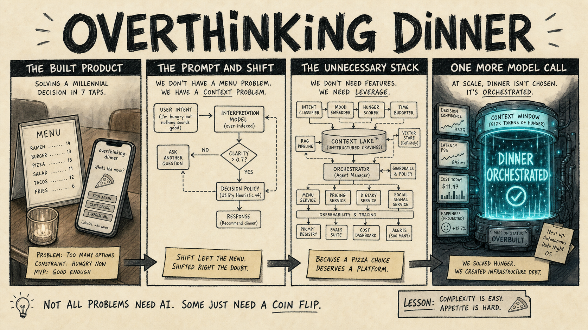
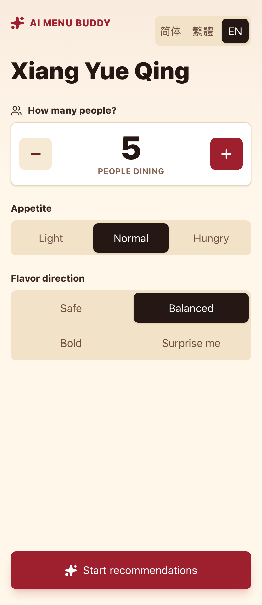
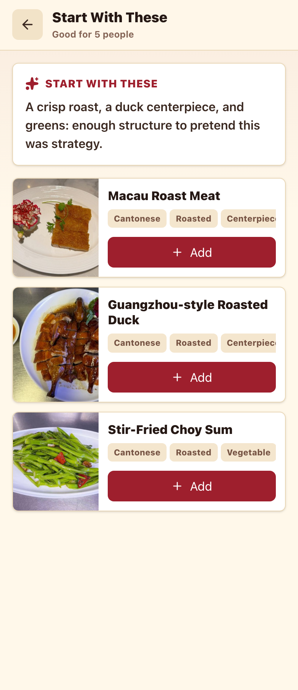
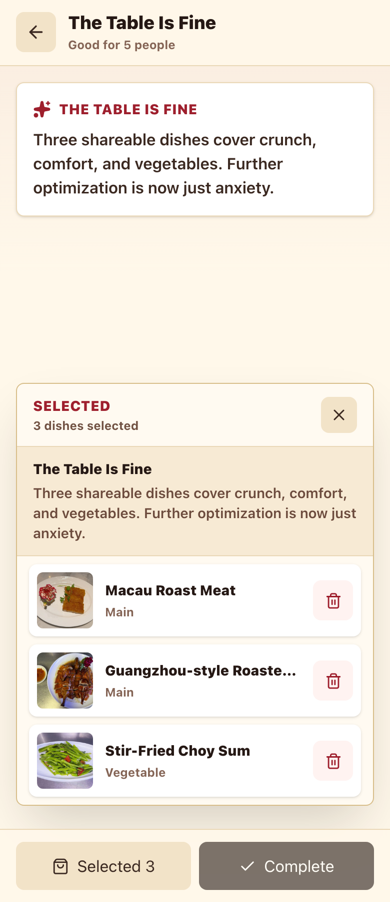

# Overthinking Dinner



## TL;DR

We had a menu. We had hunger. Tragically, we also had AI.

`overthinking-dinner` is a local ordering assistant for the ancient civic crisis of deciding what five people should eat. Pick the party size, appetite, and general level of chaos; it recommends real dishes from the menu and keeps going until everyone can stop pretending they had a strong opinion.

The current menu is Xiang Yue Qing. Another restaurant can be swapped in through `src/data/restaurant-menu.json`, assuming you too enjoy turning dinner into structured data.

## Screenshots

<p align="center">
  
  
  
</p>

## What It Does, Unfortunately

- Recommends actual menu item IDs instead of hallucinating a $38 seasonal metaphor.
- Balances party size, appetite, staples, vegetables, texture, spice, and shareability.
- Speaks Simplified Chinese, Traditional Chinese, and English, because indecision is international.
- Uses source dish photos when the restaurant has them, and a suspicious little placeholder when it does not.
- Reads your local Codex ChatGPT session from `~/.codex/auth.json`, so the app stays local and your AI credit remains your problem.

## Run It

```bash
npm install
npm run dev
```

Open `http://localhost:3000`.

Useful rituals:

```bash
npm run lint
npm run typecheck
npm run build
```

## The Big Idea

Some apps solve problems.

This one preserves the problem, wraps it in a context window, and ships it.
